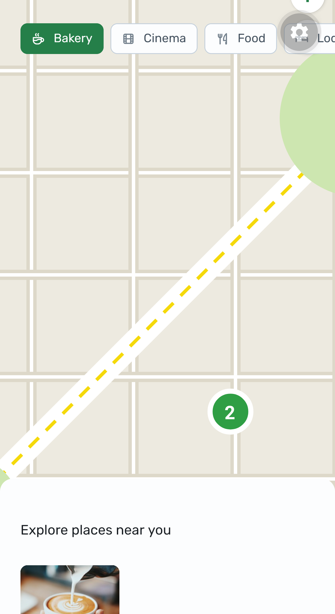

# Nearby — React Native monorepo

> English | [Português](#português)

Study project (Rocketseat NLW Pocket Mobile) refactored toward a React Native role: coupon discovery with native map, category filter, bottom-sheet list, market detail and QR coupon redemption via camera.

> History: originally built in December 2024 on Expo SDK 52; refactored in September 2026 and upgraded to Expo SDK 57 (see [Why the SDK upgrade](#sdk-upgrade-52--57) below).

## Screenshots

<p align="center">
  
  <br /><em>Home: stylized map with numbered pins, category filter and bottom-sheet list (real device).</em>
</p>

## Structure

```
apps/mobile/  -> Expo Router + React Native (SDK 57), map + camera coupon flow
apps/api/     -> Express + Prisma + SQLite, categories / markets / coupons
docs/         -> SETUP, TESTING-EXPO-GO, TROUBLESHOOTING
```

## Maps: original × current × production

| | Original | Current (this repo) | Production path |
|---|---|---|---|
| Tech | Native Google Maps (`react-native-maps`) | Stylized SVG preview (`src/components/simulated-map/`) | MapLibre + dev-client, own key |
| Tiles | Google (needs key) | Drawn, zero network | Own tile source |
| Coordinates | Real GPS + API | Real GPS + API (same) | Real GPS + API (same) |
| Cost | Paid Google billing | Free | Free (EAS free tier + OSM-compatible tiles) |

Why not native tiles here: the Google Maps key bundled in Expo Go Android (SDK 55–57) is expired server-side, so tiles can't authenticate and there is no budget for a private key. The same tap-pin → detail flow runs on the preview, and the in-app “Why?” notice explains it.

## Quick start

Prerequisites: Node 22, Expo Go (SDK 57) on your phone, PC and phone on the same Wi-Fi.

```bash
npm install                       # workspaces: installs api + mobile
cp apps/api/.env.example apps/api/.env
cp apps/mobile/.env.example apps/mobile/.env
# edit apps/mobile/.env -> EXPO_PUBLIC_API_URL=http://<YOUR_LAN_IP>:3333
npx --prefix apps/api prisma migrate dev
npm run dev:api                    # healthcheck: GET http://<YOUR_LAN_IP>:3333/categories
./node_modules/.bin/expo start ./apps/mobile --clear --lan
```

Open Expo Go (SDK 57) and scan the QR, or enter `exp://<YOUR_LAN_IP>:8081` manually. Full test script in [`docs/TESTING-EXPO-GO.md`](docs/TESTING-EXPO-GO.md).

## Docs

| Doc | Content |
|-----|---------|
| [`docs/SETUP.md`](docs/SETUP.md) | Detailed install, env, seed, healthcheck |
| [`docs/TESTING-EXPO-GO.md`](docs/TESTING-EXPO-GO.md) | Android + iOS test script with Expo Go |
| [`docs/TROUBLESHOOTING.md`](docs/TROUBLESHOOTING.md) | Symptom → cause → fix → alternative for common failures |

## Known issues

- **Maps are a stylized SVG preview** (`src/components/simulated-map/`), not live tiles: the Google Maps key bundled in Expo Go Android (SDK 55–57) is expired server-side (verified Aug 2026), so native tiles can't authenticate and there is no budget for a private key. The preview plots REAL data (user GPS + all 22 API markets) with tappable pins into the same detail flow. Production path: MapLibre + dev-client build with our own key.
- iOS renders Apple Maps natively when a dev-client is used (no key needed) — expected; iOS verified by code review, Android is the tested device.
- App language is English-only (UI strings + API seed translated September 2026).

## SDK upgrade 52 → 57

Previous version: Expo SDK 52 (React Native 0.76.5, React 18, expo-router v4) — the stack from the original December 2024 bootcamp project.

Why it was upgraded (September 2026): Expo Go is version-locked — it only runs projects matching its own SDK. The test devices run Expo Go for SDK 57, which refuses to open an SDK 52 bundle (`version mismatch`). Upgrading the project (React Native 0.86, React 19, expo-router v6 line ~57.0.x) was chosen over sideloading an old Go build because sideloading only works on Android (iOS App Store ships the latest Go only) and an up-to-date SDK reads better for hiring.

What changed: `expo`, `expo-router`, `expo-camera`, `expo-location`, `expo-font`, `expo-linking`, `expo-splash-screen`, `expo-status-bar`, `expo-system-ui`, `expo-web-browser` to their `~57` lines, `react-native-maps` 1.18 → 1.27, `react-native-reanimated` 3 → 4, React 18 → 19, missing config plugins (`expo-splash-screen`, `expo-status-bar`, `expo-web-browser`) registered in `app.json`. No app code changes were needed — `tsc --noEmit` passes with zero errors.

---

## Português

Projeto de estudo (Rocketseat NLW Pocket Mobile) refatorado com foco em vaga React Native: descoberta de cupons com mapa nativo, filtro por categoria, lista em bottom-sheet, detalhe do estabelecimento e resgate de cupom via QR Code na câmera.

> Histórico: construído originalmente em dezembro de 2024 com Expo SDK 52; refatorado em setembro de 2026 com upgrade para Expo SDK 57 (ver [seção de upgrade](#sdk-upgrade-52--57) acima — motivo: Expo Go version-locked).

## Estrutura

```
apps/mobile/  -> Expo Router + React Native (SDK 57), mapa + fluxo de cupom com câmera
apps/api/     -> Express + Prisma + SQLite, categorias / mercados / cupons
docs/         -> SETUP, TESTING-EXPO-GO, TROUBLESHOOTING (em inglês)
```

## Início rápido

Pré-requisitos: Node 22, Expo Go (SDK 57) no celular, PC e celular na mesma Wi-Fi.

```bash
npm install                       # workspaces: instala api + mobile
cp apps/api/.env.example apps/api/.env
cp apps/mobile/.env.example apps/mobile/.env
# edite apps/mobile/.env -> EXPO_PUBLIC_API_URL=http://<SEU_IP_LAN>:3333
npx --prefix apps/api prisma migrate dev
npm run dev:api                    # healthcheck: GET http://<SEU_IP_LAN>:3333/categories
./node_modules/.bin/expo start ./apps/mobile --clear --lan
```

Abra o Expo Go (SDK 57) e escaneie o QR, ou digite `exp://<SEU_IP_LAN>:8081` manualmente. Roteiro completo em [`docs/TESTING-EXPO-GO.md`](docs/TESTING-EXPO-GO.md) e erros comuns em [`docs/TROUBLESHOOTING.md`](docs/TROUBLESHOOTING.md).
